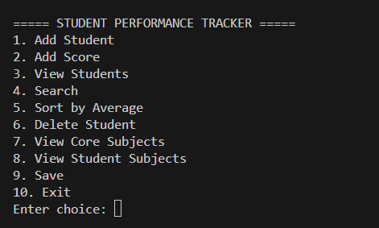
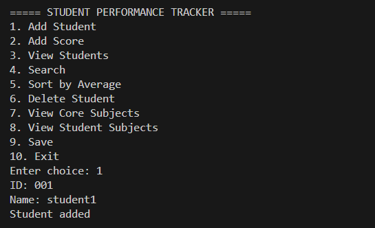
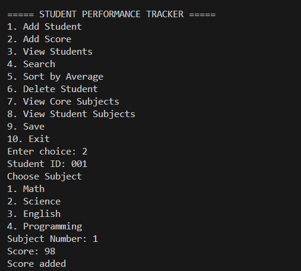
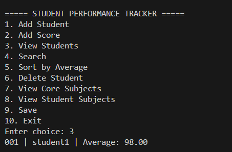
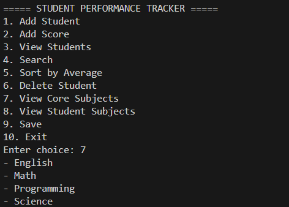

# Hugo_Janssen_FinalProject

## Video Demonstration

YouTube Link:
https://www.youtube.com/watch?v=EGZctqN0ia0

---

## Project Description
The Student Performance Tracker CLI is a Python command-line application that manages student records, scores, and performance. It demonstrates Object-Oriented Programming, data structures, and file handling in a simple academic tracking system.

---

## Features
- Add new students with ID and name  
- Add scores for core subjects (Math, Science, English, Programming)  
- View all student records with average scores  
- Search students by name  
- Sort students by average score  
- Delete student records  
- View core subjects  
- View subjects assigned to a student  
- Save all data to a JSON file  

---

## Screenshots

### Main Menu

### Add Student

### Add Score

### View Students

### View SUBJECTS

---

## Setup Instructions

### Requirements
- Python 3.x installed

No external libraries are required.

---

### Installation
1. Download or clone the repository  
2. Place all files in one folder  

---

## File Structure
